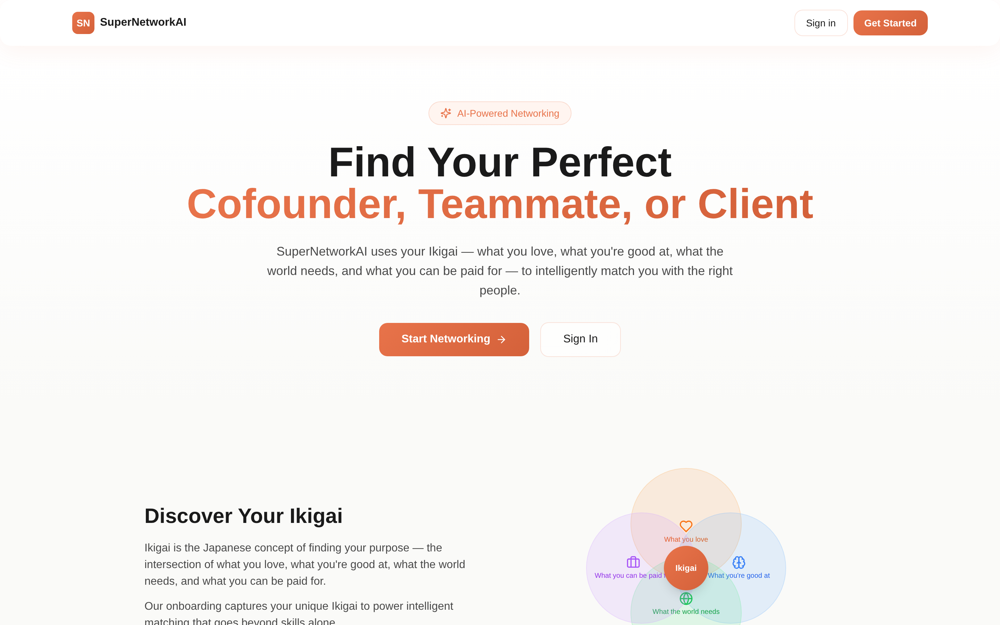

# SuperNetworkAI

An AI-powered networking platform that intelligently matches professionals based on their **Ikigai** — the Japanese concept representing the intersection of what you love, what you're good at, what the world needs, and what you can be paid for.



## Features

- **Ikigai-Based Matching** — Creates meaningful connections beyond just skill overlap by aligning purpose, passion, and profession
- **AI-Powered Search** — Natural language search with intelligent query parsing via Together AI
- **Match Scoring & Explanations** — AI generates personalized explanations for why two professionals are a good match
- **Connection Types** — Support for Cofounder, Teammate, Client, and Mentor relationships
- **5-Step Onboarding** — Guided profile creation covering Ikigai discovery, skills, portfolio, social links, and work preferences
- **In-App Messaging** — Direct communication between matched and connected users
- **Privacy Controls** — User-controlled visibility settings and blocking features

## Tech Stack

| Layer | Technology |
|---|---|
| Framework | Next.js 14 (App Router) |
| Language | TypeScript 5.5 |
| Styling | Tailwind CSS 3.4 |
| Authentication | NextAuth 4.24 (Credentials) |
| Database | Supabase (PostgreSQL) |
| AI | Together AI API (`openai/gpt-oss-120b`) |
| Validation | Zod 3.23 |
| Icons | Lucide React |

## Project Structure

```
src/
├── app/                        # Next.js App Router pages & API routes
│   ├── (auth)/                 # Login & registration pages
│   ├── api/                    # Backend API endpoints
│   │   ├── auth/               # Authentication (NextAuth + registration)
│   │   ├── onboarding/         # Profile completion
│   │   ├── search/             # AI-powered search
│   │   ├── matches/            # Match suggestions
│   │   ├── profile/            # Profile management
│   │   ├── connections/        # Connection requests
│   │   └── messages/           # Messaging system
│   ├── dashboard/              # Main dashboard with AI matches
│   ├── onboarding/             # 5-step profile setup wizard
│   ├── profile/[id]/           # User profile viewing
│   ├── search/                 # Search interface
│   ├── matches/                # Browse all matches
│   ├── messages/               # Messaging interface
│   └── settings/               # User settings
├── components/
│   ├── layout/                 # Navbar, AuthProvider, LotusPetals
│   └── ui/                     # Button, Card, Input, Avatar, Badge, Modal
├── lib/
│   ├── auth.ts                 # NextAuth configuration
│   ├── supabase.ts             # Supabase client initialization
│   ├── ai.ts                   # Together AI integration
│   ├── matching.ts             # Match scoring algorithm
│   └── utils.ts                # Helper utilities
├── types/
│   └── index.ts                # TypeScript interfaces
supabase/
└── migration.sql               # Database schema & indexes
```

## Getting Started

### Prerequisites

- Node.js 18+
- A [Supabase](https://supabase.com) account (free tier works)
- A [OpenRouter](https://openrouter.ai/api) API key

### Installation

1. **Clone the repository**

   ```bash
   git clone https://github.com/PratikSutar39/SuperNetworkAI.git
   cd SuperNetworkAI
   ```

2. **Install dependencies**

   ```bash
   npm install
   ```

3. **Configure environment variables**

   Copy the example file and fill in your credentials:

   ```bash
   cp .env.example .env.local
   ```

   Required variables:

   | Variable | Description |
   |---|---|
   | `NEXT_PUBLIC_SUPABASE_URL` | Supabase project URL |
   | `NEXT_PUBLIC_SUPABASE_ANON_KEY` | Supabase anonymous/public key |
   | `SUPABASE_SERVICE_ROLE_KEY` | Supabase service role key (server-side only) |
   | `NEXTAUTH_SECRET` | Random string for signing JWTs (32+ characters) |
   | `NEXTAUTH_URL` | App URL, e.g. `http://localhost:3000` |
   | `AI_API_KEY` | Together AI API key |
   | `AI_API_BASE_URL` | `https://api.together.xyz/v1` |
   | `AI_MODEL` | `openai/gpt-oss-120b` |

4. **Set up the database**

   Open the Supabase SQL Editor and run the contents of `supabase/migration.sql`. This creates all required tables, indexes, and constraints.

5. **Start the development server**

   ```bash
   npm run dev
   ```

   The app will be available at [http://localhost:3000](http://localhost:3000).

## Available Scripts

| Command | Description |
|---|---|
| `npm run dev` | Start the development server with hot reload |
| `npm run build` | Create an optimized production build |
| `npm run start` | Start the production server |
| `npm run lint` | Run ESLint checks |

## Database Schema

The application uses the following Supabase (PostgreSQL) tables:

| Table | Purpose |
|---|---|
| `users` | Core user accounts (email, name, password hash, avatar) |
| `profiles` | Detailed profiles including Ikigai fields, skills, interests, bio, portfolio, social links |
| `match_criteria` | AI-generated or user-defined match preferences (desired skills, intent, availability) |
| `connections` | Connection requests between users with status tracking (pending/accepted/rejected) |
| `messages` | Direct messages organized by conversation |
| `blocked_users` | User blocking for safety and privacy |
| `visibility_settings` | Per-user privacy controls (show/hide email, skills, Ikigai, portfolio, social links) |

## Matching Algorithm

Matches are scored on a 0–100 scale using a weighted formula:

| Component | Weight | Description |
|---|---|---|
| Skill Overlap | 35% | Matches desired skills with candidate skills, with bonus points for complementary skills |
| Intent Compatibility | 30% | Evaluates alignment between connection types (e.g. cofounder ↔ cofounder/teammate) |
| Working Style | 20% | Compares remote, hybrid, in-person, or flexible preferences |
| Availability | 15% | Matches full-time, part-time, freelance, or flexible schedules |

Top matches receive AI-generated explanations describing why the connection would be valuable.

## API Endpoints

### Authentication
- `POST /api/auth/register` — Register a new user
- `POST /api/auth/[...nextauth]` — NextAuth sign-in/sign-out/session

### Profile & Onboarding
- `POST /api/onboarding` — Save profile during onboarding
- `GET /api/profile` — Retrieve user profile
- `POST /api/profile` — Update user profile

### Discovery
- `GET /api/matches` — Get top 10 AI-suggested matches
- `POST /api/search` — AI-powered natural language search

### Social
- `GET /api/connections` — Get connection status
- `POST /api/connections` — Send a connection request
- `GET /api/messages` — Get conversations
- `POST /api/messages` — Send a message

All endpoints except registration and NextAuth routes require authentication.

## Onboarding Flow

New users complete a 5-step guided setup:

1. **Ikigai Discovery** — What you love, what you're good at, what the world needs, what you can be paid for
2. **Skills & Interests** — Tag-based input and connection intent selection
3. **Portfolio & CV** — Headline, bio, portfolio URL, and CV text
4. **Social Profiles** — LinkedIn, GitHub, Twitter, and website URLs
5. **Working Preferences** — Availability and working style selection

After completion, AI match criteria are automatically generated from the profile.

## License

This project is private.
